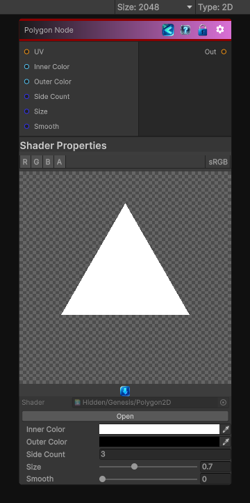

<link rel="stylesheet" href="../_assets/theme.css">

<button type="button" class="genesis-theme-toggle" data-genesis-theme-toggle aria-label="Toggle theme">Dark</button>

---
category: "Generators/Shapes"
---

# Polygon 2D

> Generates a polygon 2 d pattern.

## Description

Generates a polygon 2 d pattern.

Inputs:
- No external inputs. This node generates its output from its internal parameters.

Settings:
- No additional settings. This node is controlled by its built-in behavior.

Output:
- A generated procedural texture or data output based on the node parameters.

## Inputs

| Name | Type | Description |
|------|------|-------------|

## Outputs

| Name | Type |
|------|------|

## Parameters

| Setting | Type | Default | Description |
|---------|------|---------|-------------|
| Inner Color | Color | (1, 1, 1, 1) | Color inside the polygon |
| Outer Color | Color | (0, 0, 0, 0) | Color outside of the polygon |
| Side Count | Float | 3 | Number of sides of the polygon, can be a non integer value |
| Size | Range | 0.7 | Size of the polygon |
| Smooth | Range | 0 | Smooth the polygon edges and creates a gradient between the color inside and outside of the polygon |
| Starryness | Range | 0 | Make a star shape out of the current polygon |
| Mode | Enum | 0 | Select the output mode. Can be either Color to output the color of the polygon or DistanceField to output the signed distance field of the polygon |

## See Also

- [Back to Polygon 2D](./generators-index.md)
