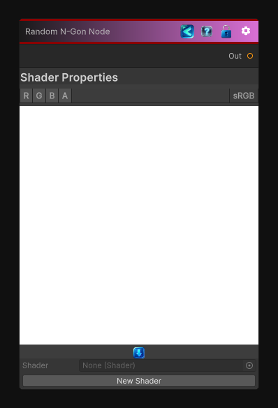

<link rel="stylesheet" href="../_assets/theme.css">

<button type="button" class="genesis-theme-toggle" data-genesis-theme-toggle aria-label="Toggle theme">Dark</button>

---
category: "Generators/Shapes"
---

# Random N-Gon

> Generates random ngon procedural content.

## Description

Generates random ngon procedural content.

Inputs:
- No external inputs. This node generates its output from its internal parameters.

Settings:
- No additional settings. This node is controlled by its built-in behavior.

Output:
- A generated procedural texture or data output based on the node parameters.

## Inputs

| Name | Type | Description |
|------|------|-------------|

## Outputs

| Name | Type |
|------|------|

## Parameters

| Setting | Type | Default | Description |
|---------|------|---------|-------------|
| Polygon Count | Int | 10 | Controls the polygon count. |
| Min Sides | Int | 3 | Controls the min sides. |
| Max Sides | Int | 8 | Controls the max sides. |
| Min Size | Float | 0.05 | Controls the min size. |
| Max Size | Float | 0.2 | Controls the max size. |
| Edge Softness | Float | 0.01 | Controls the edge softness. |
| Base Color | Color | (1, 0.5, 0.2, 1) | Controls the base color. |
| Color Variation | Color | (0.5, 0.5, 0.5, 0) | Controls the color variation. |
| Seed | int | 52 | Controls the seed. |

## See Also

- [Back to Random N-Gon](./generators-index.md)
