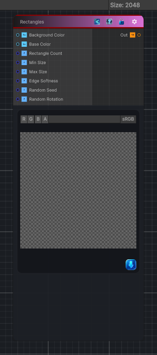

<link rel="stylesheet" href="../_assets/theme.css">

<button type="button" class="genesis-theme-toggle" data-genesis-theme-toggle aria-label="Toggle theme">Dark</button>

---
category: "Generators/Shapes"
---

# Rectangles

> Generates a rectangles pattern.

## Description

Generates a rectangles pattern.

Inputs:
- No external inputs. This node generates its output from its internal parameters.

Settings:
- No additional settings. This node is controlled by its built-in behavior.

Output:
- A generated procedural texture or data output based on the node parameters.

## Inputs

| Name | Type | Description |
|------|------|-------------|
| Background Color | Color |  |
| Base Color | Color |  |
| Rectangle Count | Single |  |
| Min Size | Single |  |
| Max Size | Single |  |
| Edge Softness | Single |  |
| Random Seed | Single |  |
| Random Rotation | Single |  |

## Outputs

| Name | Type |
|------|------|
| Out | Texture2D |

## Parameters

| Setting | Type | Default | Description |
|---------|------|---------|-------------|
| Background Color | Color | (0, 0, 0, 1) | Controls the background color. |
| Base Color | Color | (1, 0.5, 0.2, 1) | Controls the base color. |
| Rectangle Count | Int | 20 | Controls the rectangle count. |
| Min Size | Float | 0.05 | Controls the min size. |
| Max Size | Float | 0.2 | Controls the max size. |
| Edge Softness | Float | 0.005 | Controls the edge softness. |
| Random Seed | Float | 52.0 | Controls the random seed. |
| Random Rotation | Enum | 1 | Controls the random rotation. |

## See Also

- [Back to Rectangles](./generators-index.md)
