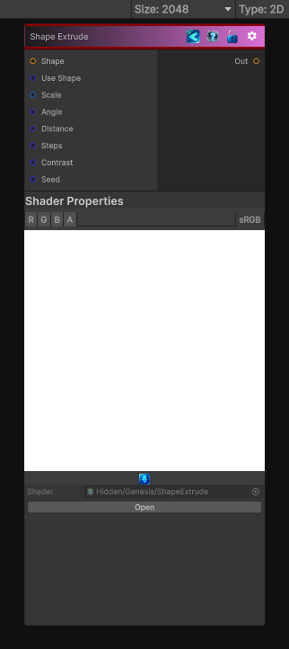

<link rel="stylesheet" href="../_assets/theme.css">

<button type="button" class="genesis-theme-toggle" data-genesis-theme-toggle aria-label="Toggle theme">Dark</button>

---
category: "Generators/Shapes"
---

# Shape Extrude

> Generates a shape extrude pattern.

## Description

Generates a shape extrude pattern.

Inputs:
- No external inputs. This node generates its output from its internal parameters.

Settings:
- No additional settings. This node is controlled by its built-in behavior.

Output:
- A generated procedural texture or data output based on the node parameters.

## Inputs

| Name | Type | Description |
|------|------|-------------|

## Outputs

| Name | Type |
|------|------|

## Parameters

| Setting | Type | Default | Description |
|---------|------|---------|-------------|
| Use Shape | Enum | 1 | Controls the use shape. |
| Scale | Vector | (1,1,0,0) | Global tiling |
| Angle | Range | 0.0 | Direction in radians |
| Distance | Range | 0.1 | Extrusion distance in UV units |
| Steps | Range | 16 | Number of samples along direction |
| Contrast | Range | 1.0 | Contrast shaping |
| Seed | int | 52 | Randomization seed |

## See Also

- [Back to Shape Extrude](./generators-index.md)
