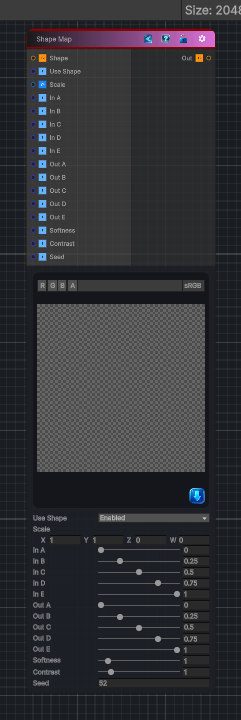

<link rel="stylesheet" href="../_assets/theme.css">

<button type="button" class="genesis-theme-toggle" data-genesis-theme-toggle aria-label="Toggle theme">Dark</button>

---
category: "Generators/Shapes"
---

# Shape Map

> Generates a shape mapper pattern.

## Description

Generates a shape mapper pattern.

Inputs:
- No external inputs. This node generates its output from its internal parameters.

Settings:
- No additional settings. This node is controlled by its built-in behavior.

Output:
- A generated procedural texture or data output based on the node parameters.

## Inputs

| Name | Type | Description |
|------|------|-------------|
| Shape | Texture2D |  |
| Use Shape | Single |  |
| Scale | Vector4 | Global tiling |
| In A | Single |  |
| In B | Single |  |
| In C | Single |  |
| In D | Single |  |
| In E | Single |  |
| Out A | Single |  |
| Out B | Single |  |
| Out C | Single |  |
| Out D | Single |  |
| Out E | Single |  |
| Softness | Single | Softness of interpolation |
| Contrast | Single | Contrast shaping |
| Seed | Single | Randomization seed |

## Outputs

| Name | Type |
|------|------|
| Out | Texture2D |

## Parameters

| Setting | Type | Default | Description |
|---------|------|---------|-------------|
| Use Shape | Enum | 1 | Controls the use shape. |
| Scale | Vector | (1,1,0,0) | Global tiling |
| In A | Range | 0.00 | Controls the in a. |
| In B | Range | 0.25 | Controls the in b. |
| In C | Range | 0.50 | Controls the in c. |
| In D | Range | 0.75 | Controls the in d. |
| In E | Range | 1.00 | Controls the in e. |
| Out A | Range | 0.00 | Controls the out a. |
| Out B | Range | 0.25 | Controls the out b. |
| Out C | Range | 0.50 | Controls the out c. |
| Out D | Range | 0.75 | Controls the out d. |
| Out E | Range | 1.00 | Controls the out e. |
| Softness | Range | 1.0 | Softness of interpolation |
| Contrast | Range | 1.0 | Contrast shaping |
| Seed | int | 52 | Randomization seed |

## See Also

- [Back to Shape Map](./generators-index.md)
