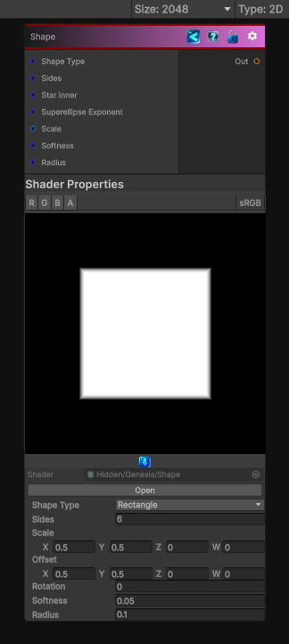

<link rel="stylesheet" href="../_assets/theme.css">

<button type="button" class="genesis-theme-toggle" data-genesis-theme-toggle aria-label="Toggle theme">Dark</button>

---
category: "Generators/Shapes"
---

# Shape

> Generates a configurable geometric shape texture.

## Description

Generates a configurable geometric shape texture.

Inputs:
- No external inputs. This node generates its output from its internal parameters.

Settings:
- No additional settings. This node is controlled by its built-in behavior.

Output:
- A generated shape texture based on the selected shape parameters.

## Inputs

| Name | Type | Description |
|------|------|-------------|

## Outputs

| Name | Type |
|------|------|

## Parameters

| Setting | Type | Default | Description |
|---------|------|---------|-------------|
| Shape Type | Int | 0 | Shape type |
| Sides | Int | 6 | Number of sides for polygon or star |
| Star Inner | Float | 0.5 | Star inner radius multiplier |
| Superellipse Exponent | Float | 4.0 | Superellipse exponent |
| Scale | Vector | (0.5, 0.5, 0, 0) | Shape scale |
| Offset | Vector | (0.5, 0.5, 0, 0) | Shape offset |
| Rotation | Float | 0 | Rotation in degrees |
| Softness | Float | 0.05 | Softness (edge falloff) |
| Radius | Float | 0.1 | Rounded corner radius |

## See Also

- [Back to Shape](./generators-index.md)
