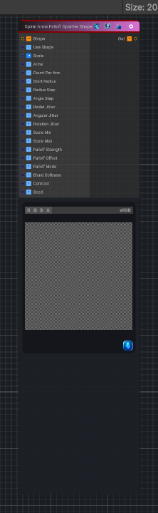

<link rel="stylesheet" href="../_assets/theme.css">

<button type="button" class="genesis-theme-toggle" data-genesis-theme-toggle aria-label="Toggle theme">Dark</button>

---
category: "Generators/Shapes"
---

# Spiral Arms Falloff Splatter Shape

> Generates a spiral arms falloff splatter shape pattern.

## Description

Generates a spiral arms falloff splatter shape pattern.

Inputs:
- No external inputs. This node generates its output from its internal parameters.

Settings:
- No additional settings. This node is controlled by its built-in behavior.

Output:
- A generated procedural texture or data output based on the node parameters.

## Inputs

| Name | Type | Description |
|------|------|-------------|
| Shape | Texture2D |  |
| Use Shape | Single |  |
| Scale | Vector4 | Global tiling |
| Arms | Single | Number of spiral arms |
| Count Per Arm | Single | Instances per arm |
| Start Radius | Single | Base radius at start |
| Radius Step | Single | Radius growth per step |
| Angle Step | Single | Base angular step per instance |
| Radial Jitter | Single | Random radial jitter |
| Angular Jitter | Single | Random angular jitter |
| Rotation Jitter | Single | Random rotation per instance |
| Scale Min | Single | Min scale |
| Scale Max | Single | Max scale |
| Falloff Strength | Single | Falloff strength |
| Falloff Offset | Single | Falloff offset |
| Falloff Mode | Single |  |
| Blend Softness | Single | Blend softness |
| Contrast | Single | Contrast shaping |
| Seed | Single | Randomization seed |

## Outputs

| Name | Type |
|------|------|
| Out | Texture2D |

## Parameters

| Setting | Type | Default | Description |
|---------|------|---------|-------------|
| Use Shape | Enum | 1 | Controls the use shape. |
| Scale | Vector | (1,1,0,0) | Global tiling |
| Arms | Range | 4 | Number of spiral arms |
| Count Per Arm | Range | 64 | Instances per arm |
| Start Radius | Range | 0.05 | Base radius at start |
| Radius Step | Range | 0.01 | Radius growth per step |
| Angle Step | Range | 0.25 | Base angular step per instance |
| Radial Jitter | Range | 0.1 | Random radial jitter |
| Angular Jitter | Range | 0.1 | Random angular jitter |
| Rotation Jitter | Range | 3.14 | Random rotation per instance |
| Scale Min | Range | 0.5 | Min scale |
| Scale Max | Range | 1.2 | Max scale |
| Falloff Strength | Range | 1.0 | Falloff strength |
| Falloff Offset | Range | 0.0 | Falloff offset |
| Falloff Mode | Enum | 1 | Controls the falloff mode. |
| Blend Softness | Range | 0.2 | Blend softness |
| Contrast | Range | 1.0 | Contrast shaping |
| Seed | int | 52 | Randomization seed |

## See Also

- [Back to Spiral Arms Falloff Splatter Shape](./generators-index.md)
