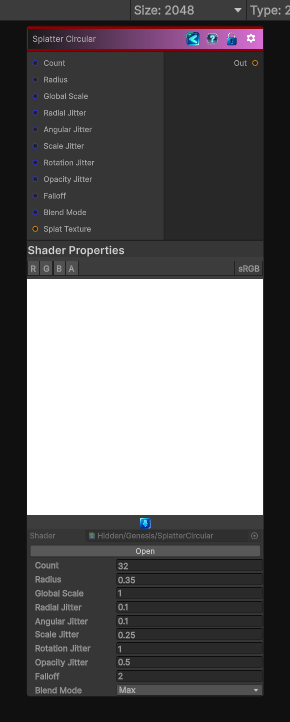

<link rel="stylesheet" href="../_assets/theme.css">

<button type="button" class="genesis-theme-toggle" data-genesis-theme-toggle aria-label="Toggle theme">Dark</button>

---
category: "Generators/Shapes"
---

# Splatter Circular

> Generates splatter circular procedural content.

## Description

Generates splatter circular procedural content.

Inputs:
- No external inputs. This node generates its output from its internal parameters.

Settings:
- No additional settings. This node is controlled by its built-in behavior.

Output:
- A generated procedural texture or data output based on the node parameters.

## Inputs

| Name | Type | Description |
|------|------|-------------|

## Outputs

| Name | Type |
|------|------|

## Parameters

| Setting | Type | Default | Description |
|---------|------|---------|-------------|
| Count | Int | 32 | Number of splats |
| Radius | Float | 0.35 | Base radius of the circle |
| Global Scale | Float | 1.0 | Global scale multiplier |
| Radial Jitter | Float | 0.1 | Radial jitter amount |
| Angular Jitter | Float | 0.1 | Angular jitter amount |
| Scale Jitter | Float | 0.25 | PerSplat scale randomness |
| Rotation Jitter | Float | 1.0 | PerSplat rotation randomness |
| Opacity Jitter | Float | 0.5 | PerSplat opacity randomness |
| Falloff | Float | 2.0 | Soft falloff of splats |
| Blend Mode | Enum | 0 | Blend mode |
| Splat Texture | 2D | white | Optional input splat shape |

## See Also

- [Back to Splatter Circular](./generators-index.md)
