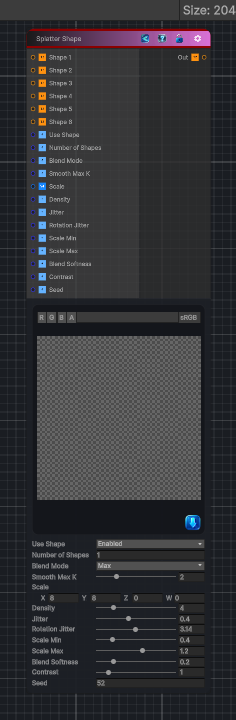

<link rel="stylesheet" href="../_assets/theme.css">

<button type="button" class="genesis-theme-toggle" data-genesis-theme-toggle aria-label="Toggle theme">Dark</button>

---
category: "Generators/Shapes"
---

# Splatter Shape

> Generates a splatter shape pattern.

## Description

Generates a splatter shape pattern.

Inputs:
- No external inputs. This node generates its output from its internal parameters.

Settings:
- No additional settings. This node is controlled by its built-in behavior.

Output:
- A generated procedural texture or data output based on the node parameters.

## Inputs

| Name | Type | Description |
|------|------|-------------|
| Shape 1 | Texture2D |  |
| Shape 2 | Texture2D |  |
| Shape 3 | Texture2D |  |
| Shape 4 | Texture2D |  |
| Shape 5 | Texture2D |  |
| Shape 6 | Texture2D |  |
| Use Shape | Single |  |
| Number of Shapes | Single |  |
| Blend Mode | Single |  |
| Smooth Max K | Single | Smooth max sharpness |
| Scale | Vector4 | Global tiling of splatter grid |
| Density | Single | Number of shapes per cell |
| Jitter | Single | Random position jitter |
| Rotation Jitter | Single | Random rotation |
| Scale Min | Single | Random scale range min |
| Scale Max | Single | Random scale range max |
| Blend Softness | Single | Blend softness |
| Contrast | Single | Contrast shaping |
| Seed | Single | Randomization seed |

## Outputs

| Name | Type |
|------|------|
| Out | Texture2D |

## Parameters

| Setting | Type | Default | Description |
|---------|------|---------|-------------|
| Use Shape | Enum | 1 | Controls the use shape. |
| Number of Shapes | int | 1 | Controls the number of shapes. |
| Blend Mode | Enum | 0 | Controls the blend mode. |
| Smooth Max K | Range | 2.0 | Smooth max sharpness |
| Scale | Vector | (8,8,0,0) | Global tiling of splatter grid |
| Density | Range | 4 | Number of shapes per cell |
| Jitter | Range | 0.4 | Random position jitter |
| Rotation Jitter | Range | 3.14 | Random rotation |
| Scale Min | Range | 0.4 | Random scale range min |
| Scale Max | Range | 1.2 | Random scale range max |
| Blend Softness | Range | 0.2 | Blend softness |
| Contrast | Range | 1.0 | Contrast shaping |
| Seed | int | 52 | Randomization seed |

## See Also

- [Back to Splatter Shape](./generators-index.md)
