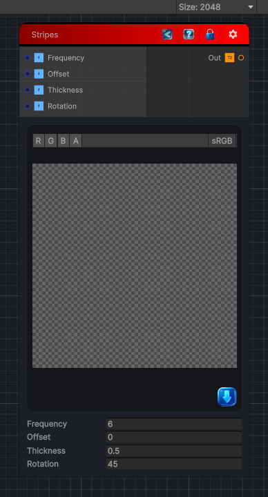

<link rel="stylesheet" href="../_assets/theme.css">

<button type="button" class="genesis-theme-toggle" data-genesis-theme-toggle aria-label="Toggle theme">Dark</button>

---
category: "Generators/Shapes"
---

# Stripes

> Generates a stripes pattern.

## Description

Generates a stripes pattern.

Inputs:
- No external inputs. This node generates its output from its internal parameters.

Settings:
- No additional settings. This node is controlled by its built-in behavior.

Output:
- A generated procedural texture or data output based on the node parameters.

## Inputs

| Name | Type | Description |
|------|------|-------------|
| Frequency | Single |  |
| Offset | Single |  |
| Thickness | Single |  |
| Rotation | Single |  |

## Outputs

| Name | Type |
|------|------|
| Out | Texture2D |

## Parameters

| Setting | Type | Default | Description |
|---------|------|---------|-------------|
| Frequency | Float | 6 | Controls the frequency. |
| Offset | Float | 0 | Controls the offset. |
| Thickness | Float | 0.5 | Controls the thickness. |
| Rotation | Float | 45 | Controls the rotation. |

## See Also

- [Back to Stripes](./generators-index.md)
