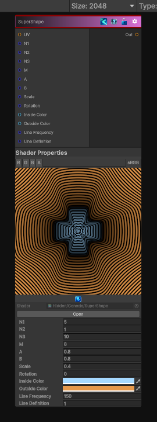

<link rel="stylesheet" href="../_assets/theme.css">

<button type="button" class="genesis-theme-toggle" data-genesis-theme-toggle aria-label="Toggle theme">Dark</button>

---
category: "Generators/Shapes"
---

# SuperShape

> Generates a super shape pattern.

## Description

Generates a super shape pattern.

Inputs:
- No external inputs. This node generates its output from its internal parameters.

Settings:
- No additional settings. This node is controlled by its built-in behavior.

Output:
- A generated procedural texture or data output based on the node parameters.

## Inputs

| Name | Type | Description |
|------|------|-------------|

## Outputs

| Name | Type |
|------|------|

## Parameters

| Setting | Type | Default | Description |
|---------|------|---------|-------------|
| N1 | Float | 5.0 | Controls the overall roundness and symmetry of the shape |
| N2 | Float | 1.0 | Affects the depth of curves between shape vertices |
| N3 | Float | 10.0 | Controls the sharpness of the shapes points |
| M | Float | 8.0 | Number of repetitions or sides in the shape |
| A | Float | 0.8 | Horizontal scale factor of the shape |
| B | Float | 0.8 | Vertical scale factor of the shape |
| Scale | Float | 0.4 | Overall size of the shape |
| Rotation | Float | 0.0 | Rotation angle of the shape (in radians) |
| Inside Color | Color | (0.65, 0.85, 1.0, 1.0) | Color used for the interior of the shape |
| Outside Color | Color | (0.9, 0.6, 0.3, 1.0) | Color used for the exterior of the shape |
| Line Frequency | Float | 150.0 | Controls how many lines appear in the pattern |
| Line Definition | Float | 1.0 | Controls how strong visible the line pattern is |

## See Also

- [Back to SuperShape](./generators-index.md)
