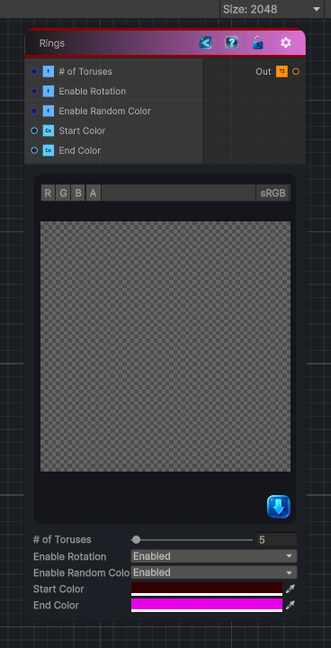

<link rel="stylesheet" href="../_assets/theme.css">

<button type="button" class="genesis-theme-toggle" data-genesis-theme-toggle aria-label="Toggle theme">Dark</button>

---
category: "Generators/Shapes"
---

# Torus

> Generates a torus pattern.

## Description

Generates a torus pattern.

Inputs:
- No external inputs. This node generates its output from its internal parameters.

Settings:
- No additional settings. This node is controlled by its built-in behavior.

Output:
- A generated procedural texture or data output based on the node parameters.

## Inputs

| Name | Type | Description |
|------|------|-------------|
| # of Toruses | Single | Number of toruses to create |
| Enable Rotation | Single | Randomize rotation |
| Enable Random Color | Single | Randomize color |
| Start Color | Color | Starting random color |
| End Color | Color | End random color |

## Outputs

| Name | Type |
|------|------|
| Out | Texture2D |

## Parameters

| Setting | Type | Default | Description |
|---------|------|---------|-------------|
| # of Toruses | Range | 5 | Number of toruses to create |
| Enable Rotation | Enum | 1 | Randomize rotation |
| Enable Random Color | Enum | 1 | Randomize color |
| Start Color | Color | (0.2,0.0,0.0,1) | Starting random color |
| End Color | Color | (0.9,0.0,0.9,1) | End random color |

## See Also

- [Back to Torus](./generators-index.md)
