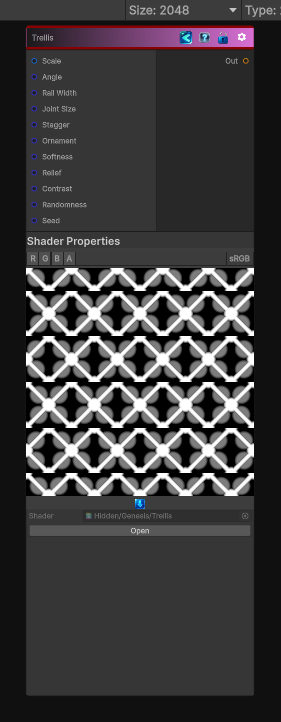

<link rel="stylesheet" href="../_assets/theme.css">

<button type="button" class="genesis-theme-toggle" data-genesis-theme-toggle aria-label="Toggle theme">Dark</button>

---
category: "Generators/Shapes"
---

# Trellis

> Generates a trellis pattern.

## Description

Generates a trellis pattern.

Inputs:
- No external inputs. This node generates its output from its internal parameters.

Settings:
- No additional settings. This node is controlled by its built-in behavior.

Output:
- A generated procedural texture or data output based on the node parameters.

## Inputs

| Name | Type | Description |
|------|------|-------------|

## Outputs

| Name | Type |
|------|------|

## Parameters

| Setting | Type | Default | Description |
|---------|------|---------|-------------|
| Scale | Vector | (5,5,0,0) | Global tiling |
| Angle | Range | 0.0 | Rotation in radians |
| Rail Width | Range | 0.12 | Width of lattice rails |
| Joint Size | Range | 0.28 | Size of rounded intersections |
| Stagger | Range | 0.5 | Offset between alternating rows |
| Ornament | Range | 0.35 | Ornament amount inside each opening |
| Softness | Range | 0.035 | Soft edge |
| Relief | Range | 0.45 | Rounded rail relief |
| Contrast | Range | 1.15 | Contrast shaping |
| Randomness | Range | 0.0 | Random variation amount |
| Seed | int | 149 | Random seed |

## See Also

- [Back to Trellis](./generators-index.md)
