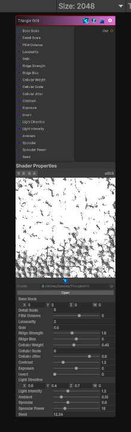

<link rel="stylesheet" href="../_assets/theme.css">

<button type="button" class="genesis-theme-toggle" data-genesis-theme-toggle aria-label="Toggle theme">Dark</button>

---
category: "Generators/Shapes"
---

# Triangle Grid

> Generates a triangle grid pattern.

## Description

Generates a triangle grid pattern.

Inputs:
- No external inputs. This node generates its output from its internal parameters.

Settings:
- No additional settings. This node is controlled by its built-in behavior.

Output:
- A generated procedural texture or data output based on the node parameters.

## Inputs

| Name | Type | Description |
|------|------|-------------|

## Outputs

| Name | Type |
|------|------|

## Parameters

| Setting | Type | Default | Description |
|---------|------|---------|-------------|
| Base Scale | Vector | (3.0, 3.0, 0, 0) | Controls the base scale. |
| Detail Scale | Float | 8.0 | Controls the detail scale. |
| FBM Octaves | Range | 5 | Controls the fbm octaves. |
| Lacunarity | Float | 2.0 | Controls the lacunarity. |
| Gain | Float | 0.5 | Controls the gain. |
| Ridge Strength | Range | 1.6 | Controls the ridge strength. |
| Ridge Bias | Range | 0.0 | Controls the ridge bias. |
| Cellular Weight | Range | 0.45 | Controls the cellular weight. |
| Cellular Scale | Float | 6.0 | Controls the cellular scale. |
| Cellular Jitter | Range | 0.8 | Controls the cellular jitter. |
| Contrast | Range | 1.2 | Controls the contrast. |
| Exposure | Range | 0.0 | Controls the exposure. |
| Invert | Range | 0 | Controls the invert. |
| Light Direction | Vector | (0.6, 0.4, 0.7, 0) | Controls the light direction. |
| Light Intensity | Range | 1.2 | Controls the light intensity. |
| Ambient | Range | 0.15 | Controls the ambient. |
| Specular | Range | 0.6 | Controls the specular. |
| Specular Power | Range | 16.0 | Controls the specular power. |
| Seed | Float | 12.34 | Controls the seed. |

## See Also

- [Back to Triangle Grid](./generators-index.md)
