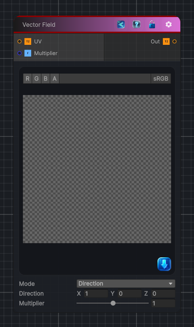

<link rel="stylesheet" href="../_assets/theme.css">

<button type="button" class="genesis-theme-toggle" data-genesis-theme-toggle aria-label="Toggle theme">Dark</button>

---
category: "Generators/Shapes"
---

# Vector Field

> Generates vector field procedural content.

## Description

Generates vector field procedural content.

Inputs:
- No external inputs. This node generates its output from its internal parameters.

Settings:
- No additional settings. This node is controlled by its built-in behavior.

Output:
- A generated procedural texture or data output based on the node parameters.

## Inputs

| Name | Type | Description |
|------|------|-------------|
| UV | Texture2D |  |
| Multiplier | Single |  |

## Outputs

| Name | Type |
|------|------|
| Out | Texture2D |

## Parameters

| Setting | Type | Default | Description |
|---------|------|---------|-------------|
| Mode | Enum | 0 | Controls the mode. |
| Direction | Vector | (1, 0, 0, 0) | Controls the direction. |
| Point Inwards | Range | 0.2 | Controls the point inwards. |
| Stripe Count | Int | 10 | Controls the stripe count. |
| Randomness | Range | 0 | Controls the randomness. |
| Seed | Int | 42 | Controls the seed. |
| Frequency | Int | 6 | Controls the frequency. |
| Scroll Vector | Vector | (0, 1, 0, 0) | Controls the scroll vector. |
| Multiplier | Range | 1 | Controls the multiplier. |

## See Also

- [Back to Vector Field](./generators-index.md)
