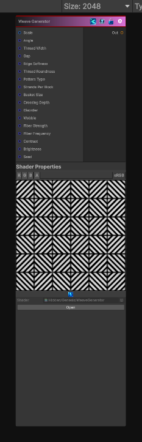

<link rel="stylesheet" href="../_assets/theme.css">

<button type="button" class="genesis-theme-toggle" data-genesis-theme-toggle aria-label="Toggle theme">Dark</button>

---
category: "Generators/Shapes"
---

# Weave Generator

> Generates a weave pattern.

## Description

Generates a weave pattern.

Inputs:
- No external inputs. This node generates its output from its internal parameters.

Settings:
- No additional settings. This node is controlled by its built-in behavior.

Output:
- A generated procedural texture or data output based on the node parameters.

## Inputs

| Name | Type | Description |
|------|------|-------------|

## Outputs

| Name | Type |
|------|------|

## Parameters

| Setting | Type | Default | Description |
|---------|------|---------|-------------|
| Scale | Vector | (6, 6, 0, 0) | Number of parquet blocks across X and Y |
| Angle | Range | 0.0 | Rotation in radians |
| Thread Width | Range | 0.62 | Thread width inside each repeat |
| Gap | Range | 0.12 | Gap between neighboring threads |
| Edge Softness | Range | 0.035 | Softness of thread edges |
| Thread Roundness | Range | 0.65 | Rounded height profile of each thread |
| Pattern Type | Range | 0 | 0 Diagonal Parquet, 1 Plain Weave, 2 Basket Weave |
| Strands Per Block | Range | 5 | Number of diagonal strands inside each parquet block |
| Basket Size | Range | 2 | Basket group size in cells |
| Crossing Depth | Range | 0.45 | How visible the thread crossing dip is |
| Disorder | Range | 0.18 | Per strand width and height variation |
| Wobble | Range | 0.12 | Subtle sideways strand wobble |
| Fiber Strength | Range | 0.22 | Fine fibers running along each strand |
| Fiber Frequency | Range | 28 | Fiber repeat frequency |
| Contrast | Range | 1.2 | Output contrast |
| Brightness | Range | 1.0 | Output brightness |
| Seed | Float | 17 | Random seed |

## See Also

- [Back to Weave Generator](./generators-index.md)
