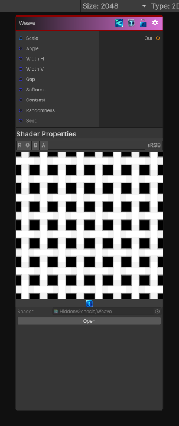

<link rel="stylesheet" href="../_assets/theme.css">

<button type="button" class="genesis-theme-toggle" data-genesis-theme-toggle aria-label="Toggle theme">Dark</button>

---
category: "Generators/Shapes"
---

# Weave

> Generates a weave pattern.

## Description

Generates a weave pattern.

Inputs:
- No external inputs. This node generates its output from its internal parameters.

Settings:
- No additional settings. This node is controlled by its built-in behavior.

Output:
- A generated procedural texture or data output based on the node parameters.

## Inputs

| Name | Type | Description |
|------|------|-------------|

## Outputs

| Name | Type |
|------|------|

## Parameters

| Setting | Type | Default | Description |
|---------|------|---------|-------------|
| Scale | Vector | (8,8,0,0) | Global tiling |
| Angle | Range | 0.0 | Rotation in radians |
| Width H | Range | 0.4 | Width of horizontal threads |
| Width V | Range | 0.4 | Width of vertical threads |
| Gap | Range | 0.1 | Gap between threads |
| Softness | Range | 0.05 | Soft edge |
| Contrast | Range | 1.0 | Contrast shaping |
| Randomness | Range | 0.0 | Random variation amount |
| Seed | int | 52 | Random seed |

## See Also

- [Back to Weave](./generators-index.md)
