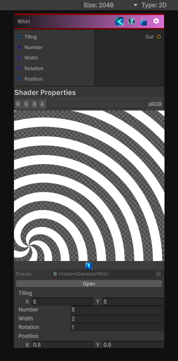

<link rel="stylesheet" href="../_assets/theme.css">

<button type="button" class="genesis-theme-toggle" data-genesis-theme-toggle aria-label="Toggle theme">Dark</button>

---
category: "Generators/Shapes"
---

# Whirl

> Generates a whirl pattern.

## Description

Generates a whirl pattern.

Inputs:
- No external inputs. This node generates its output from its internal parameters.

Settings:
- No additional settings. This node is controlled by its built-in behavior.

Output:
- A generated procedural texture or data output based on the node parameters.

## Inputs

| Name | Type | Description |
|------|------|-------------|

## Outputs

| Name | Type |
|------|------|

## Parameters

| Setting | Type | Default | Description |
|---------|------|---------|-------------|
| Tiling | Vector, 2 | (5, 5, 0, 0) | Controls the tiling. |
| Number | Int | 5 | Controls the number. |
| Width | Int | 2 | Controls the width. |
| Rotation | Float | 1 | Controls the rotation. |
| Position | Vector, 2 | (0.5, 0.5, 0, 0) | Controls the position. |

## See Also

- [Back to Whirl](./generators-index.md)
