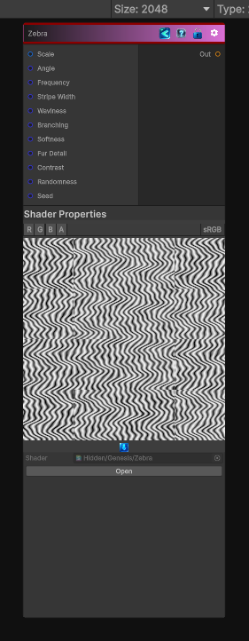

<link rel="stylesheet" href="../_assets/theme.css">

<button type="button" class="genesis-theme-toggle" data-genesis-theme-toggle aria-label="Toggle theme">Dark</button>

---
category: "Generators/Shapes"
---

# Zebra

> Generates a zebra pattern.

## Description

Generates a zebra pattern.

Inputs:
- No external inputs. This node generates its output from its internal parameters.

Settings:
- No additional settings. This node is controlled by its built-in behavior.

Output:
- A generated procedural texture or data output based on the node parameters.

## Inputs

| Name | Type | Description |
|------|------|-------------|

## Outputs

| Name | Type |
|------|------|

## Parameters

| Setting | Type | Default | Description |
|---------|------|---------|-------------|
| Scale | Vector | (4,4,0,0) | Global tiling |
| Angle | Range | 0.0 | Rotation in radians |
| Frequency | Range | 9 | Number of stripe cycles |
| Stripe Width | Range | 0.45 | Width of dark stripes |
| Waviness | Range | 0.55 | Amount of stripe waviness |
| Branching | Range | 0.35 | Amount of branching and pinching |
| Softness | Range | 0.035 | Soft edge |
| Fur Detail | Range | 0.35 | Furlike tonal grain |
| Contrast | Range | 1.15 | Contrast shaping |
| Randomness | Range | 0.35 | Random variation amount |
| Seed | int | 331 | Random seed |

## See Also

- [Back to Zebra](./generators-index.md)
