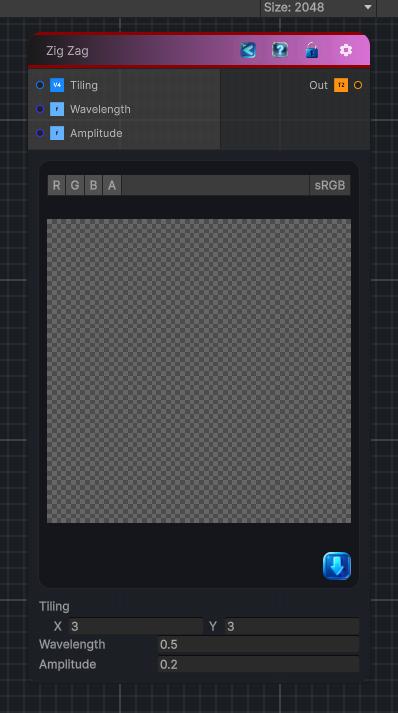

<link rel="stylesheet" href="../_assets/theme.css">

<button type="button" class="genesis-theme-toggle" data-genesis-theme-toggle aria-label="Toggle theme">Dark</button>

---
category: "Generators/Shapes"
---

# Zig Zag

> Generates zig zag procedural content.

## Description

Generates zig zag procedural content.

Inputs:
- No external inputs. This node generates its output from its internal parameters.

Settings:
- No additional settings. This node is controlled by its built-in behavior.

Output:
- A generated procedural texture or data output based on the node parameters.

## Inputs

| Name | Type | Description |
|------|------|-------------|
| Tiling | Vector4 |  |
| Wavelength | Single |  |
| Amplitude | Single |  |

## Outputs

| Name | Type |
|------|------|
| Out | Texture2D |

## Parameters

| Setting | Type | Default | Description |
|---------|------|---------|-------------|
| Tiling | Vector, 2 | (3, 3, 0, 0) | Controls the tiling. |
| Wavelength | Float | 0.5 | Controls the wavelength. |
| Amplitude | Float | 0.2 | Controls the amplitude. |

## See Also

- [Back to Zig Zag](./generators-index.md)
