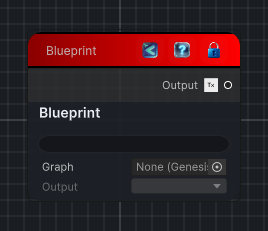

<link rel="stylesheet" href="../_assets/theme.css">

<button type="button" class="genesis-theme-toggle" data-genesis-theme-toggle aria-label="Toggle theme">Dark</button>

---
category: "Graph"
---

# Blueprint

> Blueprint Node exposes the serialized output of another Genesis graph as a reusable texture or mesh source.

## Description

Blueprint Node exposes the serialized output of another Genesis graph as a reusable texture or mesh source.

Assign a Genesis graph asset, choose one of its output nodes, and this node will process and save that graph output in the editor before passing the serialized output into the current graph.

## Inputs

| Name | Type | Description |
|------|------|-------------|

## Outputs

| Name | Type |
|------|------|

## Parameters

| Setting | Type | Default | Description |
|---------|------|---------|-------------|
| nodeVariables | VariableStorage | AhahGames.GenesisNoise.Graph.VariableStorage | |
| GUID | String | 7e320ce4-997b-43af-aa9b-5c33fffee185 | |
| expanded | Boolean | False | |

## See Also

- [Back to Blueprint](./graph-index.md)
