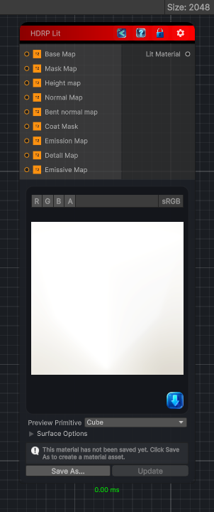

<link rel="stylesheet" href="../_assets/theme.css">

<button type="button" class="genesis-theme-toggle" data-genesis-theme-toggle aria-label="Toggle theme">Dark</button>

---
category: "Material/HDRP"
---

# HDRP Lit

> Output a Lit HDRP Material

## Description

Output a Lit HDRP Material

## Inputs

| Name | Type | Description |
|------|------|-------------|
| Emissive Map | Texture2D |  |
| Detail Map | Texture2D |  |
| Emission Map | Texture2D |  |
| Coat Mask | Texture2D |  |
| Bent normal map | Texture2D |  |
| Normal Map | Texture2D |  |
| Height map | Texture2D |  |
| Mask Map | Texture2D |  |
| Base Map | Texture2D |  |

## Outputs

| Name | Type |
|------|------|
| Lit Material | Material |

## Parameters

| Setting | Type | Default | Description |
|---------|------|---------|-------------|
| primitiveType | PrimitiveType | Cube | |
| normalAmount | Single | 0 | |
| metallicAmount | Single | 0 | |
| smoothnessAmount | Single | 0.5 | |
| baseColor | Color | RGBA(1.000, 1.000, 1.000, 1.000) | |
| useEmission | Boolean | False | |
| emissionColor | Color | RGBA(0.000, 0.000, 0.000, 0.000) | |
| globIllumination | eGlobIllum | None | |
| specOccMode | eSOM | AO | |
| addPrecomVelocity | Boolean | False | |
| asset | Material | — | |
| nodeVariables | VariableStorage | AhahGames.GenesisNoise.Graph.VariableStorage | |
| GUID | String | a83629c8-3ded-476a-9391-a89f03f55dbf | |
| expanded | Boolean | False | |

## See Also

- [Back to HDRP Lit](./material-index.md)
