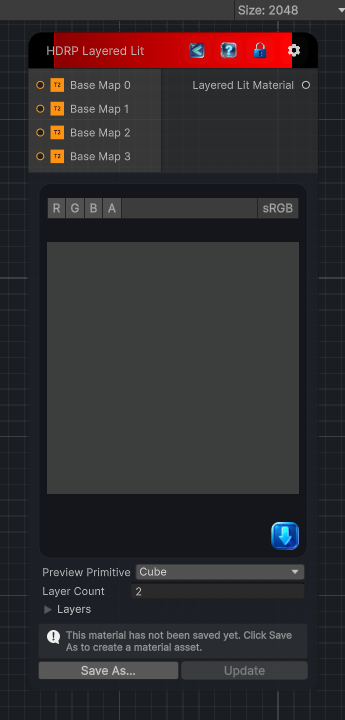

<link rel="stylesheet" href="../_assets/theme.css">

<button type="button" class="genesis-theme-toggle" data-genesis-theme-toggle aria-label="Toggle theme">Dark</button>

---
category: "Material/HDRP"
---

# Layered Lit

> Output an HDRP Layered Lit material (up to four layers).

## Description

Output an HDRP Layered Lit material (up to four layers).

## Inputs

| Name | Type | Description |
|------|------|-------------|

## Outputs

| Name | Type |
|------|------|

## Parameters

| Setting | Type | Default | Description |
|---------|------|---------|-------------|
| asset | Material | — | |
| primitiveType | PrimitiveType | Cube | |
| baseColor0 | Color | RGBA(1.000, 1.000, 1.000, 1.000) | |
| baseColor1 | Color | RGBA(0.800, 0.800, 0.800, 1.000) | |
| baseColor2 | Color | RGBA(0.600, 0.600, 0.600, 1.000) | |
| baseColor3 | Color | RGBA(0.400, 0.400, 0.400, 1.000) | |
| metallicAmount | Single | 0 | |
| smoothnessAmount | Single | 0.5 | |
| layerCount | Int32 | 2 | |
| nodeVariables | VariableStorage | AhahGames.GenesisNoise.Graph.VariableStorage | |
| GUID | String | fe5b3896-7c22-4695-9f0c-427b411f52b1 | |
| expanded | Boolean | False | |

## See Also

- [Back to Layered Lit](./material-index.md)
