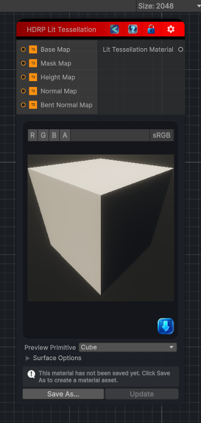

<link rel="stylesheet" href="../_assets/theme.css">

<button type="button" class="genesis-theme-toggle" data-genesis-theme-toggle aria-label="Toggle theme">Dark</button>

---
category: "Material/HDRP"
---

# Lit Tessellation

> Output an HDRP Lit Tessellation material.

## Description

Output an HDRP Lit Tessellation material.

## Inputs

| Name | Type | Description |
|------|------|-------------|
| Bent Normal Map | Texture2D |  |
| Normal Map | Texture2D |  |
| Height Map | Texture2D |  |
| Mask Map | Texture2D |  |
| Base Map | Texture2D |  |

## Outputs

| Name | Type |
|------|------|
| Lit Tessellation Material | Material |

## Parameters

| Setting | Type | Default | Description |
|---------|------|---------|-------------|
| asset | Material | — | |
| primitiveType | PrimitiveType | Cube | |
| baseColor | Color | RGBA(1.000, 1.000, 1.000, 1.000) | |
| metallicAmount | Single | 0 | |
| smoothnessAmount | Single | 0.5 | |
| normalAmount | Single | 1 | |
| tessellationFactor | Single | 4 | |
| nodeVariables | VariableStorage | AhahGames.GenesisNoise.Graph.VariableStorage | |
| GUID | String | fc230f86-9958-4cdd-886f-5738922886a8 | |
| expanded | Boolean | False | |

## See Also

- [Back to Lit Tessellation](./material-index.md)
