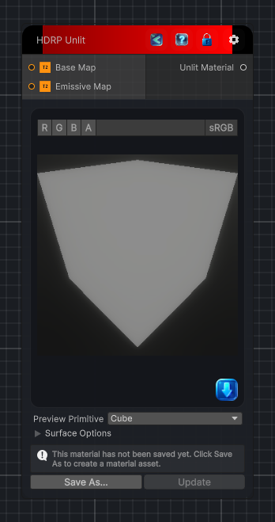

<link rel="stylesheet" href="../_assets/theme.css">

<button type="button" class="genesis-theme-toggle" data-genesis-theme-toggle aria-label="Toggle theme">Dark</button>

---
category: "Material/HDRP"
---

# Unlit

> Output an HDRP Unlit material.

## Description

Output an HDRP Unlit material.

## Inputs

| Name | Type | Description |
|------|------|-------------|

## Outputs

| Name | Type |
|------|------|

## Parameters

| Setting | Type | Default | Description |
|---------|------|---------|-------------|
| asset | Material | — | |
| primitiveType | PrimitiveType | Cube | |
| baseColor | Color | RGBA(1.000, 1.000, 1.000, 1.000) | |
| useEmission | Boolean | False | |
| emissionColor | Color | RGBA(0.000, 0.000, 0.000, 1.000) | |
| alphaCutoff | Boolean | False | |
| cutoffValue | Single | 0.5 | |
| doubleSided | Boolean | False | |
| nodeVariables | VariableStorage | AhahGames.GenesisNoise.Graph.VariableStorage | |
| GUID | String | d054b43b-6868-4b94-8ce7-f350ec55c66a | |
| expanded | Boolean | False | |

## See Also

- [Back to Unlit](./material-index.md)
