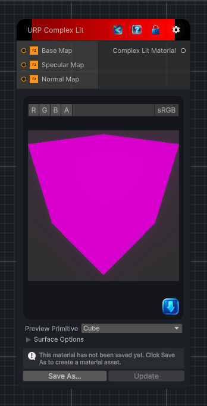

<link rel="stylesheet" href="../_assets/theme.css">

<button type="button" class="genesis-theme-toggle" data-genesis-theme-toggle aria-label="Toggle theme">Dark</button>

---
category: "Material/URP"
---

# Complex Lit

> Output a URP Complex Lit material (metallic/specular superset of Lit).

## Description

Output a URP Complex Lit material (metallic/specular superset of Lit).

## Inputs

| Name | Type | Description |
|------|------|-------------|

## Outputs

| Name | Type |
|------|------|

## Parameters

| Setting | Type | Default | Description |
|---------|------|---------|-------------|
| asset | Material | — | |
| primitiveType | PrimitiveType | Cube | |
| baseColor | Color | RGBA(1.000, 1.000, 1.000, 1.000) | |
| specularColor | Color | RGBA(0.200, 0.200, 0.200, 1.000) | |
| metallicAmount | Single | 0 | |
| smoothnessAmount | Single | 0.5 | |
| nodeVariables | VariableStorage | AhahGames.GenesisNoise.Graph.VariableStorage | |
| GUID | String | a11aeb5d-a595-4387-acea-5daa5463b6ff | |
| expanded | Boolean | False | |

## See Also

- [Back to Complex Lit](./material-index.md)
