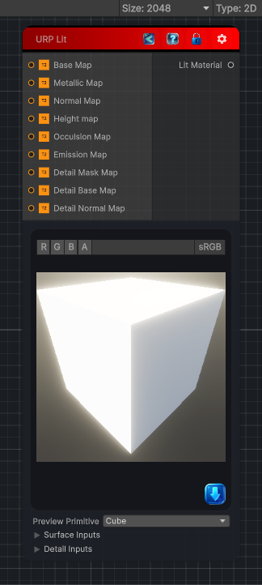

<link rel="stylesheet" href="../_assets/theme.css">

<button type="button" class="genesis-theme-toggle" data-genesis-theme-toggle aria-label="Toggle theme">Dark</button>

---
category: "Material/URP"
---

# Lit

> Output a Lit URP Material

## Description

Output a Lit URP Material

## Inputs

| Name | Type | Description |
|------|------|-------------|

## Outputs

| Name | Type |
|------|------|

## Parameters

| Setting | Type | Default | Description |
|---------|------|---------|-------------|
| primitiveType | PrimitiveType | Cube | |
| workflowMode | eWorkflowMode | Specular | |
| surfaceType | eSurfaceType | Opaque | |
| alphaClipping | Boolean | False | |
| receiveShadows | Boolean | True | |
| metallicAmount | Single | 0 | |
| smoothnessAmount | Single | 0.5 | |
| normalAmount | Single | 10 | |
| smoothSource | eSmoothSource | metallic | |
| baseColor | Color | RGBA(1.000, 1.000, 1.000, 1.000) | |
| useEmission | Boolean | False | |
| emissionColor | Color | RGBA(0.000, 0.000, 0.000, 0.000) | |
| tiling | Vector2 | (1.00, 1.00) | |
| offset | Vector2 | (0.00, 0.00) | |
| detailTiling | Vector2 | (1.00, 1.00) | |
| detailOffset | Vector2 | (0.00, 0.00) | |
| specularHighlights | Boolean | True | |
| environmentReflections | Boolean | True | |
| sortingPriority | Int32 | 0 | |
| gpuInstancing | Boolean | False | |
| albemic | Boolean | False | |
| nodeVariables | VariableStorage | AhahGames.GenesisNoise.Graph.VariableStorage | |
| GUID | String | 83643225-ac3c-4861-8743-1c2e7b7145b2 | |
| expanded | Boolean | False | |

## See Also

- [Back to Lit](./material-index.md)
