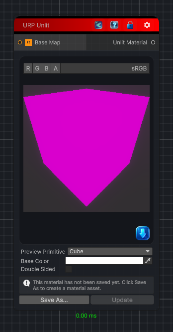

<link rel="stylesheet" href="../_assets/theme.css">

<button type="button" class="genesis-theme-toggle" data-genesis-theme-toggle aria-label="Toggle theme">Dark</button>

---
category: "Material/URP"
---

# Unlit

> Output a URP Unlit material.

## Description

Output a URP Unlit material.

## Inputs

| Name | Type | Description |
|------|------|-------------|
| Base Map | Texture2D |  |

## Outputs

| Name | Type |
|------|------|
| Unlit Material | Material |

## Parameters

| Setting | Type | Default | Description |
|---------|------|---------|-------------|
| asset | Material | — | |
| primitiveType | PrimitiveType | Cube | |
| baseColor | Color | RGBA(1.000, 1.000, 1.000, 1.000) | |
| doubleSided | Boolean | False | |
| nodeVariables | VariableStorage | AhahGames.GenesisNoise.Graph.VariableStorage | |
| GUID | String | 2ec02a3d-8e3e-4cfa-9a2b-8dad71301a0e | |
| expanded | Boolean | False | |

## See Also

- [Back to Unlit](./material-index.md)
