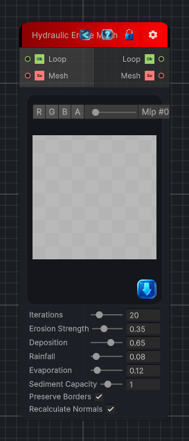

<link rel="stylesheet" href="../_assets/theme.css">

<button type="button" class="genesis-theme-toggle" data-genesis-theme-toggle aria-label="Toggle theme">Dark</button>

---
category: "Mesh"
---

# Hydraulic Erode Mesh

> Simulates rainfall, sediment transport, erosion, deposition, and evaporation directly across a mesh's vertex network.

## Description

Simulates rainfall, sediment transport, erosion, deposition, and evaporation directly across a mesh's vertex network.

## Inputs

| Name | Type | Description |
|------|------|-------------|
| Mesh | GameObject |  |
| Loop | Object |  |

## Outputs

| Name | Type |
|------|------|
| Mesh | GameObject |
| Loop | Object |

## Parameters

| Setting | Type | Default | Description |
|---------|------|---------|-------------|
| nodeVariables | VariableStorage | AhahGames.GenesisNoise.Graph.VariableStorage | |
| GUID | String | e94848bd-e1c7-4e9a-a996-7ba61221b91c | |
| expanded | Boolean | False | |

## See Also

- [Back to Hydraulic Erode Mesh](./mesh-index.md)
