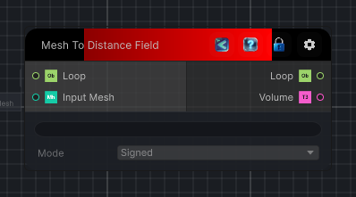

<link rel="stylesheet" href="../_assets/theme.css">

<button type="button" class="genesis-theme-toggle" data-genesis-theme-toggle aria-label="Toggle theme">Dark</button>

---
category: "Mesh"
---

# Mesh To Volume

> Transform a Mesh into a distance field. The distance field can be either signed or unsigned depending on the mode.

## Description

Transform a Mesh into a distance field. The distance field can be either signed or unsigned depending on the mode.

Note that the unsigned distance field is faster to compute.

## Inputs

| Name | Type | Description |
|------|------|-------------|
| Input Mesh | GenesisMesh |  |
| Loop | Object |  |

## Outputs

| Name | Type |
|------|------|
| Volume | Texture3D |
| Loop | Object |

## Parameters

| Setting | Type | Default | Description |
|---------|------|---------|-------------|
| mode | Mode | Signed | |
| conservativeRaster | Boolean | False | |
| nodeVariables | VariableStorage | AhahGames.GenesisNoise.Graph.VariableStorage | |
| GUID | String | d3fb8dcf-34af-4251-97b1-f157bc8eb601 | |
| expanded | Boolean | False | |

## See Also

- [Back to Mesh To Volume](./mesh-index.md)
