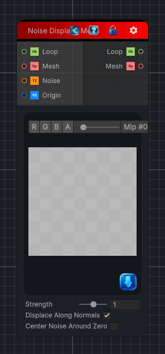

<link rel="stylesheet" href="../_assets/theme.css">

<button type="button" class="genesis-theme-toggle" data-genesis-theme-toggle aria-label="Toggle theme">Dark</button>

---
category: "Mesh"
---

# Noise Displace Mesh

> Applies a noise texture to each vertex of a mesh object.

## Description

Applies a noise texture to each vertex of a mesh object.

## Inputs

| Name | Type | Description |
|------|------|-------------|
| Origin | Vector2 |  |
| Noise | Texture2D |  |
| Mesh | GameObject |  |
| Loop | Object |  |

## Outputs

| Name | Type |
|------|------|
| Mesh | GameObject |
| Loop | Object |

## Parameters

| Setting | Type | Default | Description |
|---------|------|---------|-------------|
| nodeVariables | VariableStorage | AhahGames.GenesisNoise.Graph.VariableStorage | |
| GUID | String | e5b80605-84bf-46ea-9d07-599dc46cc187 | |
| expanded | Boolean | False | |

## See Also

- [Back to Noise Displace Mesh](./mesh-index.md)
