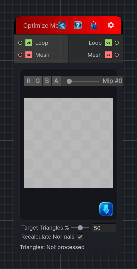

<link rel="stylesheet" href="../_assets/theme.css">

<button type="button" class="genesis-theme-toggle" data-genesis-theme-toggle aria-label="Toggle theme">Dark</button>

---
category: "Mesh"
---

# Optimize Mesh

> Optimizes a mesh by attempting to reduce its triangle count to a target percentage of the original mesh.

## Description

Optimizes a mesh by attempting to reduce its triangle count to a target percentage of the original mesh.

## Inputs

| Name | Type | Description |
|------|------|-------------|
| Mesh | GameObject |  |
| Loop | Object |  |

## Outputs

| Name | Type |
|------|------|
| Mesh | GameObject |
| Loop | Object |

## Parameters

| Setting | Type | Default | Description |
|---------|------|---------|-------------|
| nodeVariables | VariableStorage | AhahGames.GenesisNoise.Graph.VariableStorage | |
| GUID | String | f2ce2216-db9a-45f6-9f03-aa43e5d30b8a | |
| expanded | Boolean | False | |

## See Also

- [Back to Optimize Mesh](./mesh-index.md)
