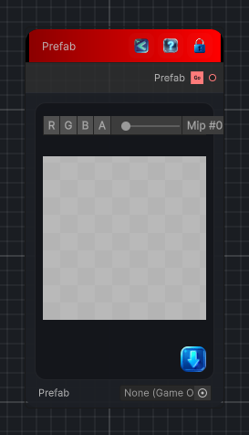

<link rel="stylesheet" href="../_assets/theme.css">

<button type="button" class="genesis-theme-toggle" data-genesis-theme-toggle aria-label="Toggle theme">Dark</button>

---
category: "Mesh"
---

# Prefab

> Outputs an assigned prefab GameObject for use in mesh graphs.

## Description

Outputs an assigned prefab GameObject for use in mesh graphs.

## Inputs

| Name | Type | Description |
|------|------|-------------|

## Outputs

| Name | Type |
|------|------|
| Prefab | GameObject |

## Parameters

| Setting | Type | Default | Description |
|---------|------|---------|-------------|
| nodeVariables | VariableStorage | AhahGames.GenesisNoise.Graph.VariableStorage | |
| GUID | String | d5e26e1f-3fd7-4fd8-a425-dfdcde8cb12d | |
| expanded | Boolean | False | |

## See Also

- [Back to Prefab](./mesh-index.md)
