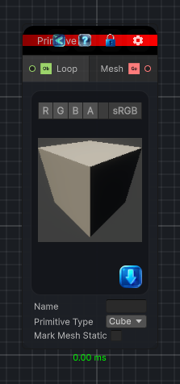

<link rel="stylesheet" href="../_assets/theme.css">

<button type="button" class="genesis-theme-toggle" data-genesis-theme-toggle aria-label="Toggle theme">Dark</button>

---
category: "Mesh"
---

# Primitive Node

> Create a 3D mesh primitive

## Description

Create a 3D mesh primitive

## Inputs

| Name | Type | Description |
|------|------|-------------|
| Loop | Object |  |

## Outputs

| Name | Type |
|------|------|
| Mesh | GameObject |

## Parameters

| Setting | Type | Default | Description |
|---------|------|---------|-------------|
| primitiveType | ePrimitiveType | Cube | |
| primitiveName | String | — | |
| nodeVariables | VariableStorage | AhahGames.GenesisNoise.Graph.VariableStorage | |
| GUID | String | 426348ab-1c9b-4d03-9e14-ed373f1474af | |
| expanded | Boolean | False | |

## See Also

- [Back to Primitive Node](./mesh-index.md)
