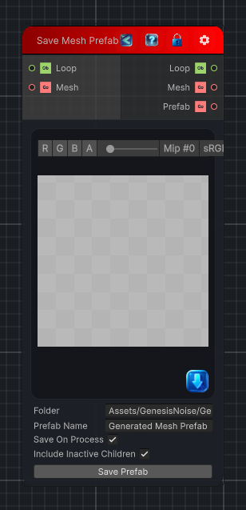

<link rel="stylesheet" href="../_assets/theme.css">

<button type="button" class="genesis-theme-toggle" data-genesis-theme-toggle aria-label="Toggle theme">Dark</button>

---
category: "Mesh"
---

# Save Mesh Prefab

> Packages a mesh GameObject hierarchy, generated meshes, LODs, renderers, colliders, and materials into a saved prefab asset.

## Description

Packages a mesh GameObject hierarchy, generated meshes, LODs, renderers, colliders, and materials into a saved prefab asset.

## Inputs

| Name | Type | Description |
|------|------|-------------|
| Mesh | GameObject |  |
| Loop | Object |  |

## Outputs

| Name | Type |
|------|------|
| Prefab | GameObject |
| Mesh | GameObject |
| Loop | Object |

## Parameters

| Setting | Type | Default | Description |
|---------|------|---------|-------------|
| nodeVariables | VariableStorage | AhahGames.GenesisNoise.Graph.VariableStorage | |
| GUID | String | 7bb19eb1-73d4-4a07-8749-93e0dc371ce2 | |
| expanded | Boolean | False | |

## See Also

- [Back to Save Mesh Prefab](./mesh-index.md)
