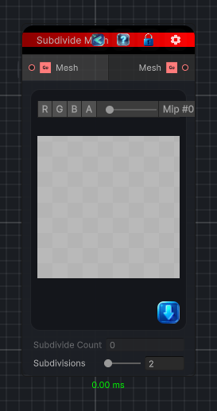

<link rel="stylesheet" href="../_assets/theme.css">

<button type="button" class="genesis-theme-toggle" data-genesis-theme-toggle aria-label="Toggle theme">Dark</button>

---
category: "Mesh"
---

# Subdivide Mesh

> Subdivides a mesh object to provide greater detail

## Description

Subdivides a mesh object to provide greater detail

## Inputs

| Name | Type | Description |
|------|------|-------------|
| Mesh | GameObject |  |

## Outputs

| Name | Type |
|------|------|
| Mesh | GameObject |

## Parameters

| Setting | Type | Default | Description |
|---------|------|---------|-------------|
| nodeVariables | VariableStorage | AhahGames.GenesisNoise.Graph.VariableStorage | |
| GUID | String | 25c7e0d9-3bd4-4a31-853b-537178a6a884 | |
| expanded | Boolean | False | |

## See Also

- [Back to Subdivide Mesh](./mesh-index.md)
