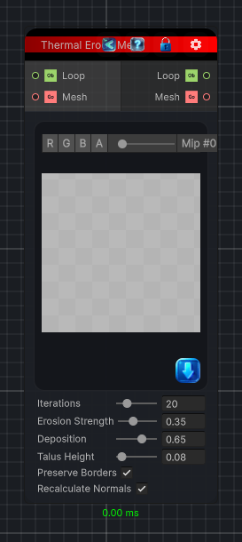

<link rel="stylesheet" href="../_assets/theme.css">

<button type="button" class="genesis-theme-toggle" data-genesis-theme-toggle aria-label="Toggle theme">Dark</button>

---
category: "Mesh"
---

# Thermal Erode Mesh

> Applies thermal-style erosion to mesh vertices by moving height from steep local peaks into lower neighboring vertices.

## Description

Applies thermal-style erosion to mesh vertices by moving height from steep local peaks into lower neighboring vertices.

## Inputs

| Name | Type | Description |
|------|------|-------------|
| Mesh | GameObject |  |
| Loop | Object |  |

## Outputs

| Name | Type |
|------|------|
| Mesh | GameObject |
| Loop | Object |

## Parameters

| Setting | Type | Default | Description |
|---------|------|---------|-------------|
| nodeVariables | VariableStorage | AhahGames.GenesisNoise.Graph.VariableStorage | |
| GUID | String | a7384d3d-4156-46fc-b242-184877ad18a0 | |
| expanded | Boolean | False | |

## See Also

- [Back to Thermal Erode Mesh](./mesh-index.md)
