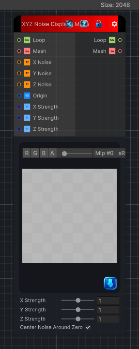

<link rel="stylesheet" href="../_assets/theme.css">

<button type="button" class="genesis-theme-toggle" data-genesis-theme-toggle aria-label="Toggle theme">Dark</button>

---
category: "Mesh"
---

# XYZ Noise Displace Mesh

> Applies separate X, Y, and Z noise textures to each vertex of a mesh object.

## Description

Applies separate X, Y, and Z noise textures to each vertex of a mesh object.

## Inputs

| Name | Type | Description |
|------|------|-------------|
| Z Strength | Single |  |
| Y Strength | Single |  |
| X Strength | Single |  |
| Origin | Vector2 |  |
| Z Noise | Texture2D |  |
| Y Noise | Texture2D |  |
| X Noise | Texture2D |  |
| Mesh | GameObject |  |
| Loop | Object |  |

## Outputs

| Name | Type |
|------|------|
| Mesh | GameObject |
| Loop | Object |

## Parameters

| Setting | Type | Default | Description |
|---------|------|---------|-------------|
| nodeVariables | VariableStorage | AhahGames.GenesisNoise.Graph.VariableStorage | |
| GUID | String | c3abac7c-98cc-4b25-bc3d-614c19d2e312 | |
| expanded | Boolean | False | |

## See Also

- [Back to XYZ Noise Displace Mesh](./mesh-index.md)
