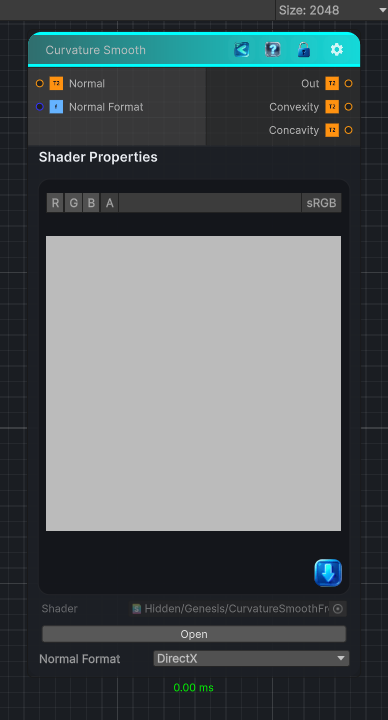

<link rel="stylesheet" href="../_assets/theme.css">

<button type="button" class="genesis-theme-toggle" data-genesis-theme-toggle aria-label="Toggle theme">Dark</button>

---
category: "Normal"
---

# Curvature Smooth

> Transforms a tangent-space normal map into a smooth curvature map.

## Description

Transforms a tangent-space normal map into a smooth curvature map.

✔ Tangent normal input
✔ Curvature from normal slope divergence
✔ Radius-based smoothing
✔ Substance-style neutral midpoint (0.5)

## Inputs

| Name | Type | Description |
|------|------|-------------|
| Normal | Texture2D |  |
| Curvature Radius | Single |  |
| Smoothing Radius | Single |  |
| Curvature Intensity | Single |  |
| Curvature Bias | Single |  |

## Outputs

| Name | Type |
|------|------|
| Out | Texture2D |

## Parameters

| Setting | Type | Default | Description |
|---------|------|---------|-------------|
| Curvature Radius | Range | 1 | Controls the curvature radius. |
| Smoothing Radius | Range | 2 | Controls the smoothing radius. |
| Curvature Intensity | Range | 1 | Controls the curvature intensity. |
| Curvature Bias | Range | 0 | Controls the curvature bias. |

## See Also

- [Back to Curvature Smooth](./normal-index.md)
