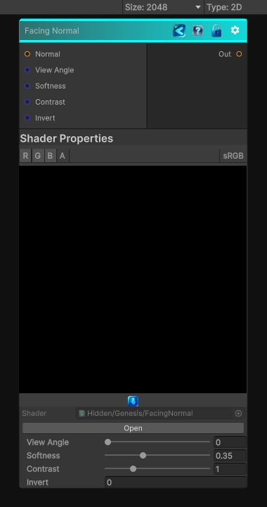

<link rel="stylesheet" href="../_assets/theme.css">

<button type="button" class="genesis-theme-toggle" data-genesis-theme-toggle aria-label="Toggle theme">Dark</button>

---
category: "Normal"
---

# Facing Normal

> Facing Normal node is one of those deceptively simple utility nodes.   It outputs a grayscale mask based on how much a surface’s normal faces a given view direction (usually the camera or a user‑defined vector).

## Description

 Facing Normal node is one of those deceptively simple utility nodes.   It outputs a grayscale mask based on how much a surface’s normal faces a given view direction (usually the camera or a user‑defined vector).
It's basically:
mask = saturate( dot(normal, viewDir) )
With optional:
- Bias / Contrast
- Invert
- Custom view direction
- Softness shaping

## Inputs

| Name | Type | Description |
|------|------|-------------|

## Outputs

| Name | Type |
|------|------|

## Parameters

| Setting | Type | Default | Description |
|---------|------|---------|-------------|
| View Angle | Range | 0.0 | Controls the view angle. |
| Softness | Range | 0.35 | Controls the softness. |
| Contrast | Range | 1.0 | Controls the contrast. |
| Invert | Int | 0 | Controls the invert. |

## See Also

- [Back to Facing Normal](./normal-index.md)
