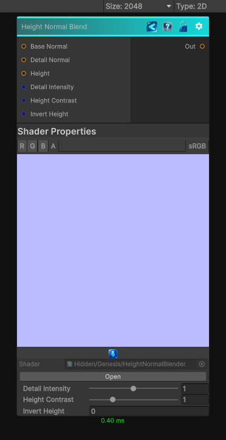

<link rel="stylesheet" href="../_assets/theme.css">

<button type="button" class="genesis-theme-toggle" data-genesis-theme-toggle aria-label="Toggle theme">Dark</button>

---
category: "Normal"
---

# Height Normal Blend

> Height Normal Blender is one of those deceptively simple but absolutely essential utility nodes. It blends:

## Description

Height Normal Blender is one of those deceptively simple but absolutely essential utility nodes. It blends:
- A base normal map
- A detail normal map
- A height map that modulates how strongly the detail normal contributes
It’s basically a height‑aware normal blend, not just a linear lerp.

## Inputs

| Name | Type | Description |
|------|------|-------------|
| Base Normal | Texture2D |  |
| Detail Normal | Texture2D |  |
| Height | Texture2D |  |
| Detail Intensity | Single |  |
| Height Contrast | Single |  |
| Invert Height | Single |  |

## Outputs

| Name | Type |
|------|------|
| Out | Texture2D |

## Parameters

| Setting | Type | Default | Description |
|---------|------|---------|-------------|
| Detail Intensity | Range | 1.0 | Controls the detail intensity. |
| Height Contrast | Range | 1.0 | Controls the height contrast. |
| Invert Height | Int | 0 | Controls the invert height. |

## See Also

- [Back to Height Normal Blend](./normal-index.md)
