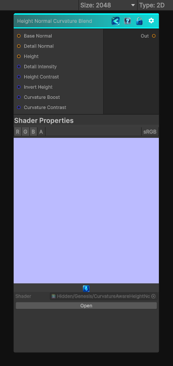

<link rel="stylesheet" href="../_assets/theme.css">

<button type="button" class="genesis-theme-toggle" data-genesis-theme-toggle aria-label="Toggle theme">Dark</button>

---
category: "Normal"
---

# Height Normal Curvature Blend

> - Take base normal, detail normal, and height

## Description

- Take base normal, detail normal, and height
- Compute curvature from the height map (Sobel → magnitude → shaping)
- Use curvature to boost detail normal intensity in high‑curvature regions
- Still respect the height‑driven blend mask
- Still use proper tangent‑space normal blending
- Fully deterministic, CRT‑safe, no derivatives
This gives you:
- Sharper detail on edges
- Softer detail in flat regions
- Height‑aware detail placement
- A more physically‑plausible blend

## Inputs

| Name | Type | Description |
|------|------|-------------|

## Outputs

| Name | Type |
|------|------|

## Parameters

| Setting | Type | Default | Description |
|---------|------|---------|-------------|
| Detail Intensity | Range | 1.0 | Controls the detail intensity. |
| Height Contrast | Range | 1.0 | Controls the height contrast. |
| Invert Height | Int | 0 | Controls the invert height. |
| Curvature Boost | Range | 1.5 | Controls the curvature boost. |
| Curvature Contrast | Range | 1.0 | Controls the curvature contrast. |

## See Also

- [Back to Height Normal Curvature Blend](./normal-index.md)
