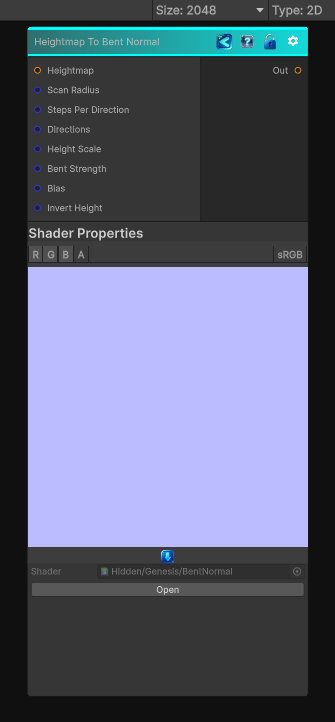

<link rel="stylesheet" href="../_assets/theme.css">

<button type="button" class="genesis-theme-toggle" data-genesis-theme-toggle aria-label="Toggle theme">Dark</button>

---
category: "Normal"
---

# Heightmap To Bent Normal

> Converts a heightmap into a bent normal map by scanning nearby height samples and bending the normal toward the least occluded direction.

## Description

Converts a heightmap into a bent normal map by scanning nearby height samples and bending the normal toward the least occluded direction.

## Inputs

| Name | Type | Description |
|------|------|-------------|

## Outputs

| Name | Type |
|------|------|

## Parameters

| Setting | Type | Default | Description |
|---------|------|---------|-------------|
| Scan Radius | Range | 16 | Maximum scan radius in pixels |
| Steps Per Direction | Int Range | 8 | Number of samples per radial direction |
| Directions | Int Range | 16 | Number of radial directions to scan |
| Height Scale | Range | 4 | Scales height differences before they bend the output normal |
| Bent Strength | Range | 1.0 | Overall bent normal strength |
| Bias | Range | 0.02 | Positive values ignore tiny height differences |
| Invert Height | Toggle | 0 | Controls the invert height. |

## See Also

- [Back to Heightmap To Bent Normal](./normal-index.md)
