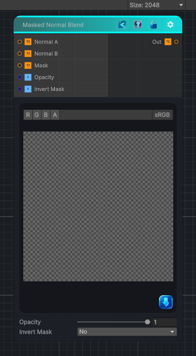

<link rel="stylesheet" href="../_assets/theme.css">

<button type="button" class="genesis-theme-toggle" data-genesis-theme-toggle aria-label="Toggle theme">Dark</button>

---
category: "Normal"
---

# Masked Normal Blend

> Blends Normal B over Normal A through a grayscale mask.

## Description

Blends Normal B over Normal A through a grayscale mask.

The mask controls where Normal B contributes, while Opacity controls its overall
strength. Reoriented normal mapping preserves detail from both normal maps.

## Inputs

| Name | Type | Description |
|------|------|-------------|
| Normal A | Texture2D | Base tangent space normal map |
| Normal B | Texture2D | Tangent space normal map blended over Normal A |
| Mask | Texture2D | Grayscale mask controlling where Normal B is applied |
| Opacity | Single | Overall strength of Normal B |
| Invert Mask | Single | Inverts the grayscale mask |

## Outputs

| Name | Type |
|------|------|
| Out | Texture2D |

## Parameters

| Setting | Type | Default | Description |
|---------|------|---------|-------------|
| Normal A | 2D | bump | Base tangent space normal map |
| Normal B | 2D | bump | Tangent space normal map blended over Normal A |
| Mask | 2D | white | Grayscale mask controlling where Normal B is applied |
| Opacity | Range | 1 | Overall strength of Normal B |
| Invert Mask | Enum | 0 | Inverts the grayscale mask |

## See Also

- [Back to Masked Normal Blend](./normal-index.md)
