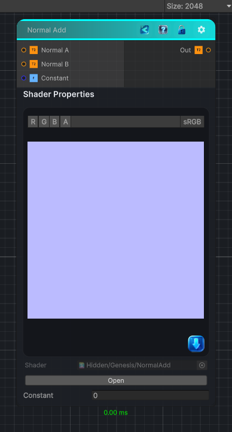

<link rel="stylesheet" href="../_assets/theme.css">

<button type="button" class="genesis-theme-toggle" data-genesis-theme-toggle aria-label="Toggle theme">Dark</button>

---
category: "Normal"
---

# Normal Add

> Add two normal maps using the surface gradient functions.

## Description

Add two normal maps using the surface gradient functions.

## Inputs

| Name | Type | Description |
|------|------|-------------|
| Normal A | Texture2D |  |
| Normal B | Texture2D |  |
| Constant | Single |  |

## Outputs

| Name | Type |
|------|------|
| Out | Texture2D |

## Parameters

| Setting | Type | Default | Description |
|---------|------|---------|-------------|
| nodeVariables | VariableStorage | AhahGames.GenesisNoise.Graph.VariableStorage | |
| GUID | String | 206bac24-a7d2-4c86-bedf-ae60fab8d09f | |
| expanded | Boolean | False | |

## See Also

- [Back to Normal Add](./normal-index.md)
