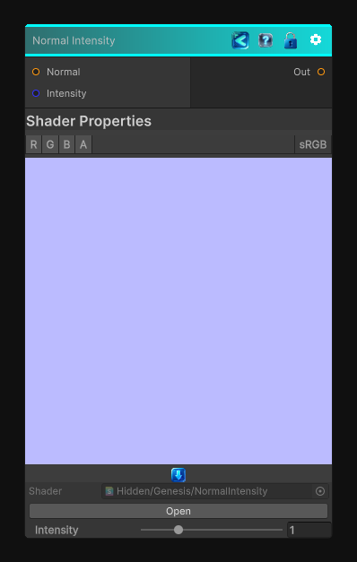

<link rel="stylesheet" href="../_assets/theme.css">

<button type="button" class="genesis-theme-toggle" data-genesis-theme-toggle aria-label="Toggle theme">Dark</button>

---
category: "Normal"
---

# Normal Intensity

> Scales the strength of a tangent-space normal map while keeping the output normalized.

## Description

Scales the strength of a tangent-space normal map while keeping the output normalized.

## Inputs

| Name | Type | Description |
|------|------|-------------|

## Outputs

| Name | Type |
|------|------|

## Parameters

| Setting | Type | Default | Description |
|---------|------|---------|-------------|
| Normal | 2D | bump | Controls the normal. |
| Intensity | Range | 1 | 0 flattens the normal, 1 keeps it unchanged, values above 1 increase strength |

## See Also

- [Back to Normal Intensity](./normal-index.md)
