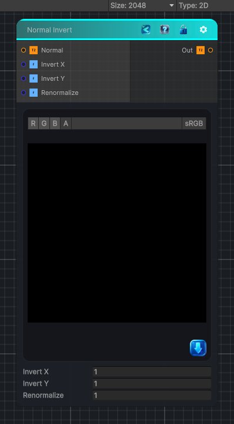

<link rel="stylesheet" href="../_assets/theme.css">

<button type="button" class="genesis-theme-toggle" data-genesis-theme-toggle aria-label="Toggle theme">Dark</button>

---
category: "Normal"
---

# Normal Invert

> - Takes a tangent‑space normal map

## Description

- Takes a tangent‑space normal map
- Converts from 0–1 → −1..1
- Flips the X and Y channels (Z stays the same)
- Re‑normalizes
- Outputs back in 0–1 space

## Inputs

| Name | Type | Description |
|------|------|-------------|
| Normal | Texture2D |  |
| Invert X | Single |  |
| Invert Y | Single |  |
| Renormalize | Single |  |

## Outputs

| Name | Type |
|------|------|
| Out | Texture2D |

## Parameters

| Setting | Type | Default | Description |
|---------|------|---------|-------------|
| Invert X | Int | 1 | Controls the invert x. |
| Invert Y | Int | 1 | Controls the invert y. |
| Renormalize | Int | 1 | Controls the renormalize. |

## See Also

- [Back to Normal Invert](./normal-index.md)
