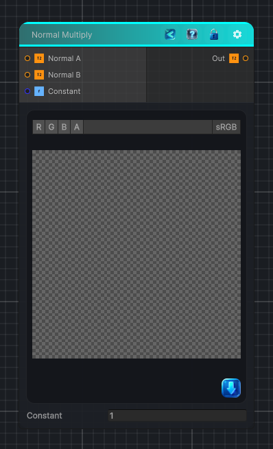

<link rel="stylesheet" href="../_assets/theme.css">

<button type="button" class="genesis-theme-toggle" data-genesis-theme-toggle aria-label="Toggle theme">Dark</button>

---
category: "Normal"
---

# Normal Multiply

> Multiplies a normal by another normal and/or a constant

## Description

Multiplies a normal by another normal and/or a constant

## Inputs

| Name | Type | Description |
|------|------|-------------|
| Normal A | Texture2D |  |
| Normal B | Texture2D |  |
| Constant | Single |  |

## Outputs

| Name | Type |
|------|------|
| Out | Texture2D |

## Parameters

| Setting | Type | Default | Description |
|---------|------|---------|-------------|
| nodeVariables | VariableStorage | AhahGames.GenesisNoise.Graph.VariableStorage | |
| GUID | String | 57173ef5-b01b-4313-8b37-cef3b09088c0 | |
| expanded | Boolean | False | |

## See Also

- [Back to Normal Multiply](./normal-index.md)
