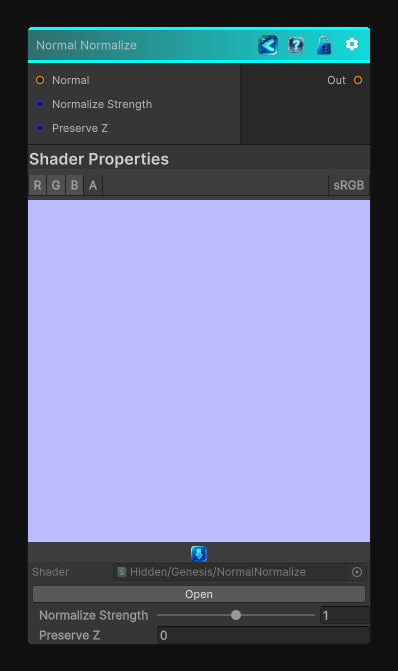

<link rel="stylesheet" href="../_assets/theme.css">

<button type="button" class="genesis-theme-toggle" data-genesis-theme-toggle aria-label="Toggle theme">Dark</button>

---
category: "Normal"
---

# Normal Normalize

> Normal Normalize is one of those tiny but essential utility nodes every procedural pipeline needs. It ensures that any incoming normal map (even if modified, blended, warped, or partially invalid) is re‑normalized back into a proper tangent‑space unit vector.

## Description

 Normal Normalize is one of those tiny but essential utility nodes every procedural pipeline needs. It ensures that any incoming normal map (even if modified, blended, warped, or partially invalid) is re‑normalized back into a proper tangent‑space unit vector.
This is especially important after:
- Height‑based blends
- Vector warps
- Curvature modulation
- Manual channel edits
- Procedural normal generation
A proper normalize step prevents shading artifacts and keeps downstream nodes stable.

## Inputs

| Name | Type | Description |
|------|------|-------------|

## Outputs

| Name | Type |
|------|------|

## Parameters

| Setting | Type | Default | Description |
|---------|------|---------|-------------|
| Normalize Strength | Range | 1.0 | Controls the normalize strength. |
| Preserve Z | Int | 0   // 0 = full normalize, 1 = keep Z magnitude | Controls the preserve z. |

## See Also

- [Back to Normal Normalize](./normal-index.md)
