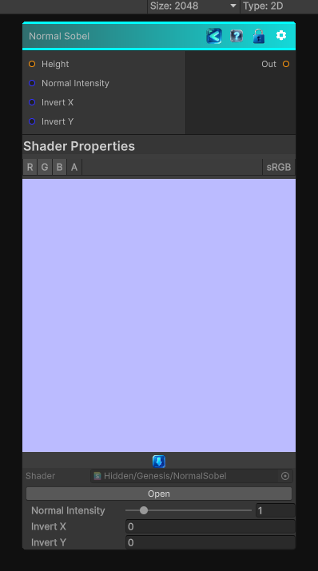

<link rel="stylesheet" href="../_assets/theme.css">

<button type="button" class="genesis-theme-toggle" data-genesis-theme-toggle aria-label="Toggle theme">Dark</button>

---
category: "Normal"
---

# Normal Sobel

> it converts a height map into a tangent‑space normal map using Sobel gradients.

## Description

it converts a height map into a tangent‑space normal map using Sobel gradients.
✔ Sobel X/Y gradient from height
✔ Adjustable intensity
✔ Proper tangent‑space normal reconstruction
✔ Deterministic, CRT‑safe sampling
✔ No derivatives, no mip bias, no nondeterminism

## Inputs

| Name | Type | Description |
|------|------|-------------|
| Height | Texture2D |  |
| Normal Intensity | Single |  |
| Invert X | Single |  |
| Invert Y | Single |  |

## Outputs

| Name | Type |
|------|------|
| Out | Texture2D |

## Parameters

| Setting | Type | Default | Description |
|---------|------|---------|-------------|
| Normal Intensity | Range | 1.0 | Controls the normal intensity. |
| Invert X | Int | 0 | Controls the invert x. |
| Invert Y | Int | 0 | Controls the invert y. |

## See Also

- [Back to Normal Sobel](./normal-index.md)
